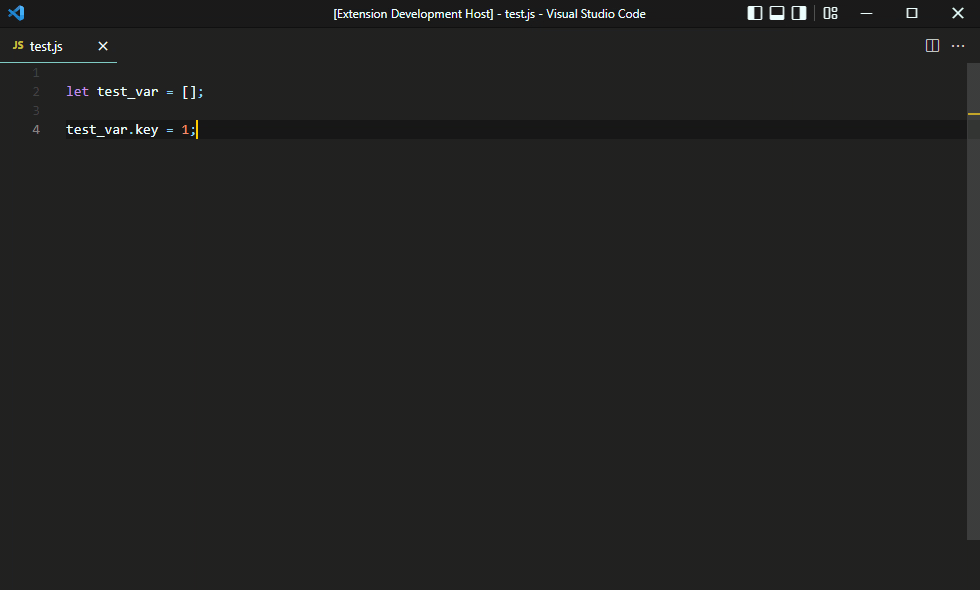
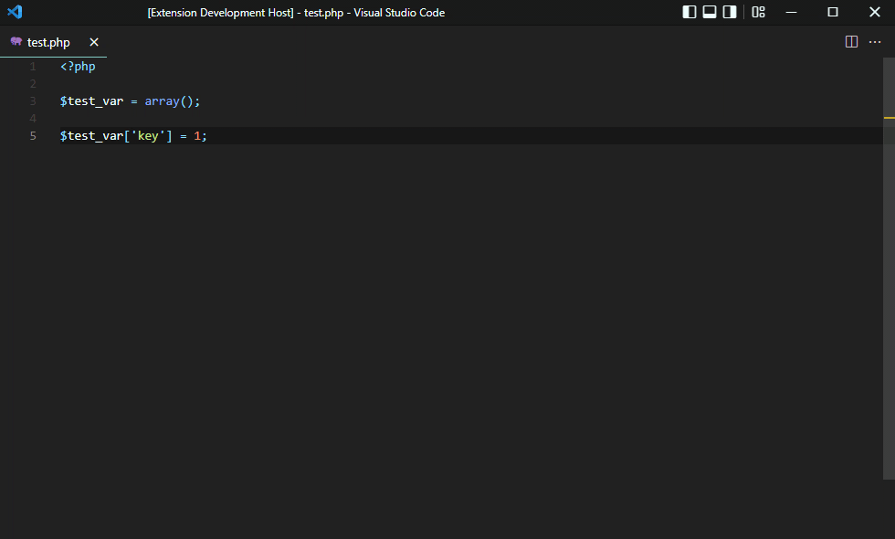
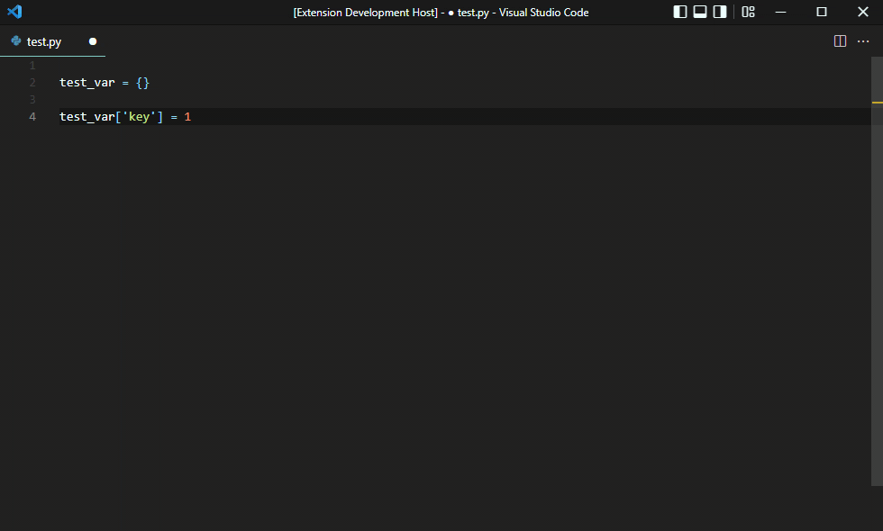

# Console Wrap PHP/JS/Python

## Donate

If you want to thank me, or promote your issue.

## Installing

Install through VS Code extensions. Search for Console Wrap PHP/JS/Python

## How to use

Press `Ctrl+Shift+Q` (Windows), or `Cmd+Shift+Q` (Mac)

## License

This software is released under the terms of the MIT license.
